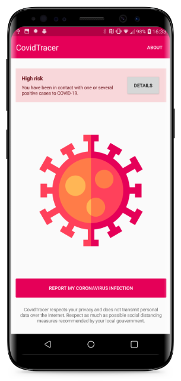
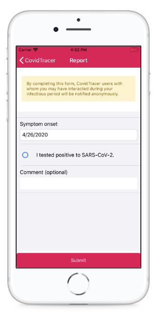

# CovidTracer

CovidTracer es una aplicacion de rastreo de contacto **decentralisada** y **anonima** diseñada para la pandema actual del COVID-19.

CovidTracer le notifica al usuario de cualquier contacto cercano con otros usuarios diagnosticados con COVID-19. 

 

CovidTracer usa Bluetooth y tecnicas criptograficas para proteger la privacidad del usuario. Los usuarios de la app no comparten informacion personal. Jamas se mantiene ningun registro de la ubicacion GPS.

CovidTracer sigue las [recomendaciones de rastreo de contacto](https://www.eff.org/deeplinks/2020/04/challenge-proximity-apps-covid-19-contacto-tracing) de la Electronic Frontier Foundation.

CovidTracer is a software libre y gratuito(GPLv3).

## Descarga e Instalacion

Google y Apple [actualmente no permiten](https://www.theverge.com/2020/3/5/21167102/apple-google-coronavirus-iphone-apps-android-misinformation-reject-ban) ninguna aplicacion relacionada al coronavirus que no este relacionada con organizaciones de la salud reconozidas o gobiernos o sus tiendas. La aplicacion aun se puede instalar por medios alternativos:

En **Android**, se puede descargar un APK instalable [aqui](https://github.com/RaphaelJ/covid-tracer/releases/download/v0.1.1/covidtracer_0.1.1.apk).

En **iOS**, solo los desarrolladores registrados de Apple pueden compilar, firmar e instalar la app en sus iPhones. Esto se puede realizar mediante la clonacion del repositorio y mediante el uso de [Visual Studio para macOS](https://visualstudio.microsoft.com/vs/mac/). La app de iOS no soporta todas las caracteristicas aun. 

## Preguntas Frecuentes

- **Cuales son las capacidades de privacidad en CovidTracer?**
CovidTracer usa tecnicas criptograficas similares a las usadas por e-commerce y crypto-monedas. Estas proveen altos niveles de privacidad que evitan que cualquiera asocie el uso de esta app con cualquiera de tus datos personales (ubicacion, nombre...).

- **Cuando deberia usar CovidTracer?**
Para eficiencia maxima, abre la app y dejala ejecutarse en 2do plano cuando interactuas con personas ajenas a tu hogas (transportes, officina, tiendas, actividades en el exterior...).

- **Que hago cuando la aplicacion detecta un contacto de alto riesgo?**
Por favor informa a la autoridad competente tan pronto como se detecte el contacto de alto-riesgo. La app no notifica a ninguna organizacion gubernamental ni de la salud sobre el caso positivo.

- **Por que pide acceso a la ubicacion la aplicacion de Android?**
La aplicacion de Android debe [pedir el permiso de ubicacion](https://developer.android.com/guide/topics/connectivity/bluetooth#Permissions) para acceder a algunas capacidades bluetooth, como el escaneo. CovidTracer no utiliza ni registra.

- **Como puedo remover cualquier informacion recolectada por la app?**
Des-instalar la aplicacion de tu smartphone va a borrar toda la informacion que recolecto la aplicacion. Si alguna vez te reportaste a ti mismo como un caso positivo, algunos datos (anonimos) asociados a tu periodo infeccioso aun van a estar disponibles a otros usuarios de la app.

- **Me gusta el proyecto. Como puedo ayudar?** 
Estoy desarrollando la aplicacion como un proyecto personalcon pocos recorsos. Recibiria con mucho gusto cualquier ayuda.
    - Si hablas un lenguaje extrangero, puedes ayudar traduciendo [uno de los archivos de localizacion](CovidTracer/Resx/);
    - Si tienes habilidades en ciencia computacional y/o cryptografia, no dudes en leer los detalles tecnicos y en proveer feedback;
    - Si eres un diseñador grafico o de UX, puedes ayudar a mejorar algunos de los componentes de la UI de la aplicacion (onboarding, iconos...);
    - Crear una applicacion (mayormente) distribuida de rastreo de contacto es posible. Por favor presiona a tu gobierno local a tener la privacidad en cuenta si estan desarrollando sus propios sistemas de rastreo de contactos.

## Detalles tecnicos

### Overview

The app constantly broadcasts a unique 20 bytes identifier over Bluetooth Low Energy to nearby devices. This identifier is randonly generated (thus can not be associated with personal information) and is renewed every hour (preventing long-term tracking). Nearby CovidTracer users constantly record these identifiers in a database located on their devices. These identifiers are not shared with any central server or entity.

If the user ever reports her/himself as positive to SARS-CoV-2, the hourly-generated identifiers coresponding to the infectious period (16 days) are anonymously published on a central server. Other app users can then compare these identifiers with the ones they recorded over the past few days.

### Details

When the app is started for the first time, a [256 bits key is generated](CovidTracer/Models/Keys/TracerKey.cs#L54) using a cryptographic random number generator:

    TracerKey = RNG()

This key will not be shared with other app users but will be used to derivate daily and hourly keys.

Every (UTC) day, [a new 256 bits key is derived](CovidTracer/Models/Keys/TracerKey.cs#L80) from the `TracerKey` using a *SHA-256 HMAC* function, together with the current date (as an ISO 8601 string):

    DailyKey = HMAC-SHA256(TracerKey, CurrentDate('YYYY-MM-DD'))
    
The original `TracerKey` can not be derived back from the `DailyKey`. 

The actual indentifier broadcasted over Bluetooth [is derived](CovidTracer/Models/Keys/DailyTracerKey.cs#L49) every (UTC) hour from the current day' key and current time. As Bluetooth Low Energy characteristics are limited to 20 bytes, this key is also truncated:

    CurrentKey = TRUNCATE(HMAC-SHA256(DailyKey, CurrentTime('YYYY-MM-DDTHH'))

If a user reports her/himself positive to SARS-CoV-2, all the generated daily identifiers used/to be used during the infectious period will be [shared with a central server](https://covid-tracer-backend.herokuapp.com/cases.json) (from 5 days before the symptoms onset, up to 11 days after). Other application instances can then derivate all hourly generated keys during the infectious period, and potentially match then with any contacto they previously had. 

Additional measures have been taken to increase privacy:

- contacto tracing keys are automatically removed from the phone after 15 days;
- The backend returns daily keys in alphabetical order, and only publishes them every 12 hours. This makes it harder to associate multiple daily keys with a single user;
- The backend does not publish daily keys of future dates, and the apps only match contacts that occured on the day associated with the key. This prevents user impersonification; 
- Bluetooth signal quality is used to evaluate proximity of nearby devices. The algorithm is calibrated to only record identifiers of devices located in the same room;
- The backend implements strict rate-limiting on reporting;
- All communication with the backend is done over HTTPS;
- The backend [is availaible](https://github.com/RaphaelJ/covid-tracer-backend) as a free and opensource software.

More advanced diagnostic and debugging information can be obtained directly in the application by tapping 10 times on the tracer key ID on the *About* page.

## Special thanks

These users provided the translation in the following languages:

- Croatian/Hrvatski: [micimacahaca](https://old.reddit.com/user/micimacahaca);
- Dutch: [vlammuh](https://www.reddit.com/user/vlammuh) and [bavoceulemans](https://github.com/bavoceulemans);
- Brazilian/Portuguese: [Raphael Salomao](https://github.com/raphaelsalomao3);
- Spanish: [Barraguesh](https://github.com/Barraguesh).